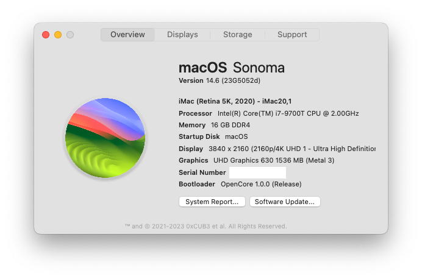

# OpenCore-HP-Elitedesk-800-G5-DM
memo for installation of macOS Sonoma on HP Elitedesk 800 G5 DM

## Hardware Information
PC name: HP Elitedesk 800 G5 DM
<!-- - Product number:  -->
- CPU: Intel Core i7-9700T 2GHz
- Memory: 16GB
- Storage: Crucial P3 500GB PCIe M.2 2280 SSD
- Display: PHL 439P1
- GPU: Intel UHD Graphics 630
- Ethernet : Intel I219LM Gigabit Network Connection
- WLAN: Intel Wireless-AC 9560 vPro + BT5
- Sound: Conexant CX20632 Audio Codec

## OpenCore
- OpenCore 1.0.0 2024-05-09

## macOS
- macOS Sonoma 14.6 beta

## Status
### Working
- Audio (AppleALC)
- Ethernet
- Bluetooth
- Wi-Fi (Airportitlwm, Sonoma_14.4Beta)
- Sleep/wake
- Keyboard and Mouse (USB/BT)

